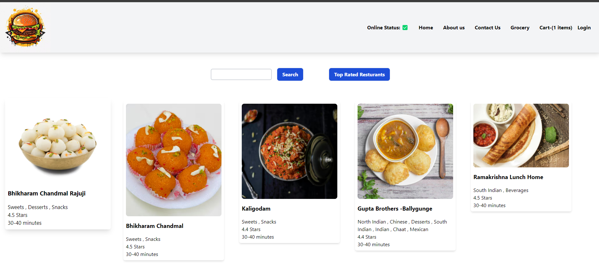

# Food-App
- Order food from the confort of your home, we show the latest restaurants available in your city, with all the details. Pick a dish,    add to cart and many more features.

# Tech-stack
 - Frontend Library: React JS
 - Styling: Tailwind CSS
 - Bundler: Parcel
 - State Management: Redux Toolkit

# Redux ToolKit
 - Installed @redux.js/toolkit and react-redux
 - Bulid our store
 - Connect our store to our app
 - Created Slice
 - dispatch
 - reducer
 - selector

# Parcel
- Dev Build
- Local Server
- HMR = Hot Module Replacement
- File Watching Algorithm - written in C++
- Caching - Faster Builds
- Image Optimization
- Minification
- Bundling
- Code Splitting

# MY FOODAPP

- Header
- Logo
- Nav Items
- Body
- Search
- RestaurantContainer
- RestaurantCard
 - # Screenshot

 - Name of Res, Star Rating, cuisine, delery tie
- Footer
- Links
- Address
- Contact 

# Two types of Export/Import

- Default Export/Import
- export default Component; import Component from "path";

- Named Export/Import
- export const Component; import {Component} from "path";

# React Hooks
- (Normal JS utility functions)

- useState() - Superpowerful State Variables in react
- useEffect()
# 2 types Routing in web apps
- Client Side Routing
- Server Side Routing

# Types of Tesing
- Unit testing
- integration Testing
- End to End Testing- e2e testing..

- React testing library uses jest library.

# how to install Testing library
- Run npm i -D @testing-library/react 
- Run npm i -D jest
- installed babel dependencies
- configure Babel
- configure parcel config file to disable default nanel transpilation

 # How to run on your local
- Clone the repository
- Run (npm init)
- Run (npm start)
- Make sure you've allow CORS extension installed in your browser.

